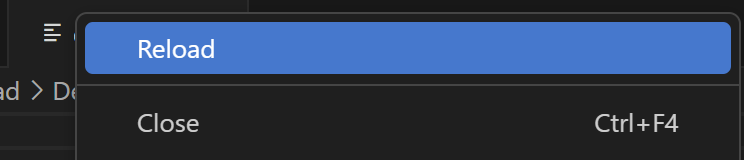
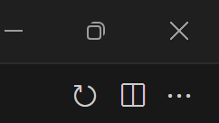
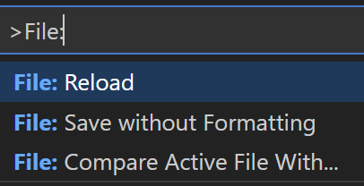

# vscode-reload-files

This extension adds the ability to reload files in the editor.
It adds what it's suggested to be missing in [vscode#179083](https://github.com/microsoft/vscode/issues/179083) and [vscode#186976](https://github.com/microsoft/vscode/issues/186976)

## Features

Reload files in the editor by right-clicking on the file tab and selecting `Reload` from the context menu.

Reload files in the editor by clicking the `Reload 🔃` in the editor title bar.

Reload files in the editor by picking "File: Reload" within the command pallete.

## Release Notes

Users appreciate release notes as you update your extension.

### 1.0.0

Initial release of vscode-reload-files
